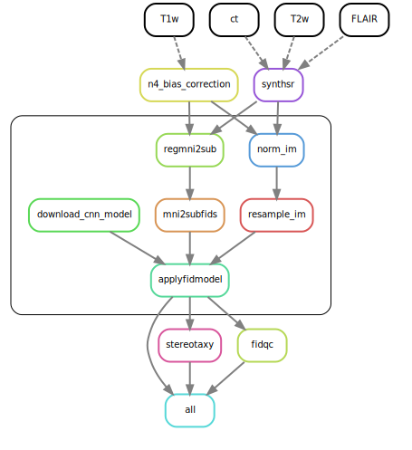

# Automatic Anatomical Fiducials (AutoAFIDs)

AIMS Lab Research Team at the Robarts Research Institute - 2023-2024

*This package is under active development. It should be stable and reproducible, but please let any of the active contributing members know if there are any bugs or unusual behaviour.*

This Python package is a standard 3D [U-Net](https://arxiv.org/abs/1505.04597) (Ronneberger et al. 2015) machine learning model based on Snakemake and SnakeBIDS workflow management tools that leverages the recent release of the anatomical fiducial framework to solve the landmark regression problem on 3D MRI images. It is currently in development phase and contains tunable parameters that are not normally exposed in most other machine learning models; the user is highly advised to get familiar with the above mentioned workflow managaments tools and read docstrings and relevant documentation before using this software. Please see the [changelog](CHANGELOG.md) for more details. 

## Workflow

A brief summary of the workflow can be found below along with its Directed Acyclic Graph (DAG) (see documentation for a detailed summary):

1. Preprocess input NIfTI files based on image modality
2. Download and apply the fiducial model 

## Processing landmark data (AFIDs)
1. Extract fiducial points from the landmark files (.fcsv is supported)
2. Generate a landmark Euclidean distance/probability map with each voxel communicating distance to an AFID of interest

## Known Issues
- Factorize apply workflow to run per landmark of interest

## Roadmap

- Model optimization

### **Full documentation:** [here](https://autoafids.readthedocs.io/en/)

## Questions, Issues, Suggestions, and Other Feedback
Please reach out if you have any questions, suggestions, or other feedback related to this software—either through email (dbansal7@uwo.ca) or the discussions page. Larger issues or feature requests can be posted and tracked via the issues page. Finally, you can also reach out to Alaa Taha, the Science Lead.
