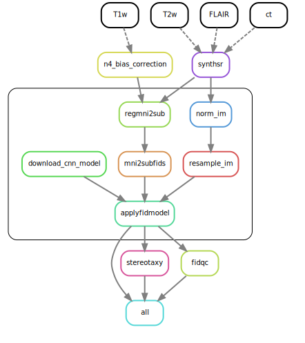

# Automatic Anatomical Fiducials (AutoAFIDs)
AIMS Lab Research Team at the Robarts Research Institute - 2023-2024

*This package is under active development. It should be stable and reproducible, but please let any of the active contributing members know if there are any bugs or unusual behaviour.*

This Python package is a standard 3D [U-Net](https://arxiv.org/abs/1505.04597) (Ronneberger et al. 2015) machine learning model based on Snakemake and SnakeBIDS workflow management tools that leverages the recent release of the anatomical fiducial framework to solve the landmark regression problem on 3D MRI images. It is currently in development phase and contains tunable parameters that are not normally exposed in most other machine learning models; the user is highly advised to get familiar with the above mentioned workflow managaments tools and read docstrings and relevant documentation before using this software. Please see the [changelog](CHANGELOG.md) for more details. 

## Table of Contents
1. [Installation](#installation)
2. [Workflow](#workflow)
2. [Train](#train)
3. [Apply](#apply)
4. [Known issues](#known-issues)
5. [Roadmap](#roadmap)
6. [Questions, Issues, Suggestions, and Other Feedback](#questions--issues)

## Installation 

### Installing Poetry
We use poetry tool for dependency management and to package the python project. You can find step by step instructions on how to install it by visiting it's official [website](https://python-poetry.org/docs/).

### Local Installation

After installing poetry, clone this repository via:

```bash
git clone https://github.com/afids/autoafids.git
```

You can then install the python package using one of the following commands, which should be executed within the repository folder (i.e., autoafids/).

```bash
poetry install
```
If you want to install in _develop mode_, use:

```bash
poetry install -e
```

## Workflow
Below is a simplified example of the workflow along with its Directed Acyclic Graph (DAG) for the `--profile` fast. Each rounded rectangle (vertex) in the DAG represents a rule, which encompasses some code or script that produces output file(s), and the arrows (edges) represent file inputs and outputs to these rules. 



### Processing landmark data (AFIDs)
1. Extract fiducial points from the landmark files (.fcsv is supported)
2. Generate a landmark Euclidean distance/probability map with each voxel communicating distance to an AFID of interest

## Train
Currently, we support generating your own models (i.e., training) in a sperate workflow (i.e., afids-cnn: https://github.com/afids/afids-CNN). For more details, see [Known Issues](#known-issues).


## Apply
Use the classic BIDS App syntax to genereate output AFID .fcsv files. For other derivative outputs, the following flags will be supported: 

`--regqc`: for quality control of registration on a BIDS dataset and its derivatives (e.g., fMRIPrep or LeadDBS derivative outputs) 

`--stereotaxy`: predicts a .fcsv file with stereotactic targets (e.g., subthalamaic nucelus) also providing AC-PC transform files in the process 

`--charing`: to make use of AFID charting analysis on a given dataset 
  
## Known Issues
- Factorize apply workflow to run per landmark of interest

## Roadmap

- Model optimization
- Extension to incorporate new modalities (i.e., CT scans)

## Questions, Issues, Suggestions, and Other Feedback
Please reach out if you have any questions, suggestions, or other feedback related to this software—either through email (dbansal7@uwo.ca) or the discussions page. Larger issues or feature requests can be posted and tracked via the issues page. Finally, you can also reach out to Alaa Taha, the Science Lead.
